## Next JS Documentation

<a name='top'></a>
| No | Subject |
| --- | ---------------------------------------------------------------------- |
| 1. | [What is rendering in web application ?](#rendering) |
| 2. | [What is CSR?](#csr) |
| 3. | [How CSR work?](#how_csr_work) |
| 4. | [Benifit of CSR](#benifit_of_csr) |
| 5. | [Side effect of CSR](#side_effect_of_csr) |
| 6. | [What is SSR?](#what_is_ssr) |
| 7. | [How CSR work?](#how_ssr_work) |
| 8. | [Benifit of CSR](#benifit_of_ssr) |
| 9. | [Side effect of CSR](#side_effect_of_ssr) |
| 10. | [What is SSG?](#what_is_ssg) |
| 11. | [How CSR work?](#how_ssg_work) |
| 12. | [Benifit of CSR](#benifit_of_ssg) |
| 13. | [What is ISR?](#what_is_isr) |
| 14. | [How work ISR?](#how_isr_work) |
| 15. | [Benifit of ISR?](#benifit_of_isr) |
| 16. | [How to generate static from sever and chashed in brower?](#how_to_generate_static_from_server_and_cashed_in_brower) |
| 17. | [How to generate static from sever and chashed in brower?](#how_to_generate_static_from_server_and_cashed_in_brower) |
| 18. | [How to create static file in server when build?](#how_to_create_static_file_in_sever_when_build) |
| 19. | [How to create static file during request with dynamic?](#how_to_create_static_file_during_request_with_dynamic) |
| 20. | [Installation of next js](#installation_of_next_js) |
| 21. | [How to use image from public directory?](#how-to-use-image-from-public-directory) |
| 22. | [How to use global CSS?](#how-use-global-css) |
| 23. | [How to use module CSS?](#how-to-use-module-css) |
| 24. | [Rules of client side rendering.](#rules-of-client-side-rendering) |
| 25. | [Rules of server side rendering](#rules-of-server-side-rendering) |
| 26. | [Rules of using both SSR & CSR](#rules-of-using-both-csr-and-ssr) |
| 27. | [When use CSR and when use SSR?](#when-use-csr-and-when-use-ssr) |
| 28. | [Basic Routing](#basic-routing) |
| 29. | [Nested Routing](#nested-routing) |
| 30. | [How to skip segment in Routing or group route?](#how-to-segment-in-routing) |
| 31. | [Dynamic Routing?](#dynamic-routing) |
| 32. | [Basic Link](#basic-link) |
| 33. | [Use next-nprogress-bar libray for showing loader.](#use-next-progress-bar-libray) |
| 34. | [How to style active link?.](#how-to-style-active-link) |
| 35. | [How to Pass query string with link and how to receive?](#how-pass-query-string-with-link-and-how-to-receive) |
| 36. | [Link-replace property](#link-replace-property) |
| 37. | [What is useRouter hook?](#what-is-use-router-hook) |
| 38. | [Master Layout concept](#master-layout-concept) |
| 39. | [Directory based layout](#directory-based-layout) |
| 40. | [Creating multiple root layout](#how-to-create-multiple-root-layout) |
| 41. | [not-found.js directory](#not-found-directory) |
| 42. | [error.js directory](#error-directory) |
| 43. | [loading.js directory](#loading-directory) |
| 44. | [route.js directory](#route-directory) |
| 45. | [Process of Data fetching by SSR](#process-of-data-fatching-by-ssr) |
| 46. | [Process of Data fetching by CSR](#process-of-data-fatching-by-csr) |
| 47. | [Process of Data factching by sychronous way](#data-fatching-by-synchronous-way) |
| 48. | [Process of Data factching by peralal way](#data-fatching-by-peralal) |
| 49. | [next.config - How to use basepath?](#how-to-use-basePath) |
| 50. | [next.config - How to use env?](#how-to-use-env) |
| 51. | [next.config - How to set response headers?](#how-to-set-response-header) |
| 52. | [next.config - How to set X-Frame option header?](#how-to-set-x-frame) |
| 53. | [next.config - Content-Security-Policy header](#content-Security-Policy-header) |
| 54. | [next.config - Permission-policy header](#permission-policy-header) |
| 55. | [next.config - Strict-Transport-Security](#Strict-Transport-Security) |
| 56. | [next.config - X-Content-Type-Options](#X-Content-Type-Options) |
| 57. | [next.config - Powered By](#Powered-By) |
| 58. | [next.config - Dist Dir Name](#Dist-Dir-Name) |
| 59. | [next.config - Connection](#Connection) |
| 60. | [next.config - Browser Source Maps](#Browser-Source-Maps) |
| 61. | [next.config - Trailing Slash](#Trailing-Slash) |
| 62. | [OPTIMIZATION - IMAGE-OPTIMIZATION](#IMAGE-OPTIMIZATION) |
| 63. | [OPTIMIZATION - Google Font Inside Next.JS](#Google-Font-Inside) |
| 64. | [OPTIMIZATION - Local Font Inside Next.JS](#Local-Font-Inside) |
| 65. | [OPTIMIZATION - SCRIPT OPTIMIZATION](#SCRIPT) |
| 66. | [OPTIMIZATION - STATIC ASSETS OPTIMIZATION](#STATIC-ASSETS) |
| 67. | [OPTIMIZATION - Lazy Loading OPTIMIZATION](#LAZY-LOADING) |
| 68. | [Backend - simple request and response](#simple-request-and-response) |
| 69. | [Backend - Working with request url params](#Working-with-request-url-params) |
| 70. | [Backend - Working with request body with json data](#Working-with-request-body-with-json-data) |
| 71. | [Backend - Working with request body with formData](#Working-with-request-body-with-formData) |
| 72. | [Backend - Working with request headers](#Working-with-request-headers) |
| 73. | [Backend - How to set custom status code/](#How-to-set-custom-status-code) |
| 74. | [Backend - How to set cookies in headers with response?](#set-cookies-in-headers-with-response) |
| 75. | [Backend - How to set token in headers with response?](#set-token-in-headers-with-response) |
| 76. | [Backend - How to redirect?](#How-to-redirect) |
| 77. | [Middleware - Apply Mutiple path in middleware](#Apply-Mutiple-path-in-middleware) |
| 78. | [Middleware - Conditional statement on middleware.js](#Conditional-statement-on-middleware) |
| 79. | [Middleware - Setting Header with Request in middleware.js](#Setting-Header-with-Request-in-middleware) |
| 80. | [Middleware - Setting Header with response in middleware.js](#Setting-Header-with-response-in-middleware) |

<a name='rendering'></a>

### What is rendering in web application ?

---

Rendering in the context of web applications refers to the process of generating the final output, usually in the form of HTML, CSS, and JavaScript, that is displayed in a web browser. It involves taking raw data, templates, and dynamic content, and converting them into a format that can be visually presented to users.

There are two main types of rendering in web applications:

- CSR - Client side rendering
- SSR - Server side rendering
  - SSG - Static site generation
  - ISR - Incremental Static Regeneration

[Go to top:arrow_up: ](#top)

<a name='csr'></a>

### What is CSR? How its work?

---

**_What is CSR?_**

- Client-side rendering (CSR) is an approach in web development where the rendering of content, including HTML, CSS, and data, is primarily handled by the web browser on the client's device using JavaScript.
- This means that the initial HTML sent by the server is minimal, often just containing the basic structure and references to JavaScript files.
- The browser then fetches data from APIs or other sources, processes it, and dynamically generates the content on the client side.

[Go to top:arrow_up: ](#top)

<a name='how_csr_work'></a>

**_How CSR work?_**

Here's a step-by-step breakdown of how client-side rendering works with an example:

_Initial Page Load:_

- When a user enters a URL or clicks a link to a web page, the server sends a minimal HTML document to the browser as below:
- This HTML document typically includes the basic structure of the page, along with references to external CSS and JavaScript files.

```jsx
<!DOCTYPE html>
<html>
<head>
    <title>Client-Side Rendering Example</title>
    <link rel="stylesheet" href="styles.css">
</head>
<body>
    <div id="app"></div>
    <script src="app.js"></script>
</body>
</html>

```

_JavaScript Execution:_

- The browser then starts executing the JavaScript code referenced in the HTML document.
- This JavaScript code is responsible for fetching data from APIs, processing that data, and rendering it on the page.

_Data Processing and Rendering:_

- Once the data is fetched, the JavaScript code processes it and generates the necessary HTML dynamically.
- This HTML is then inserted into the DOM (Document Object Model) of the page.

_User Interaction:_

- As the user interacts with the page, such as marking tasks as complete or adding new tasks, the JavaScript code handles these interactions by updating the DOM and possibly making additional API requests.

[Go to top:arrow_up: ](#top)

<a name='benifit_of_csr'></a>

**_Benifit of CSR:_**

**_Interactive User Experience:_** CSR allows for highly interactive and dynamic user experiences. Changes to the content can be made without requiring a full page reload, providing a smoother and more seamless interaction.

**_Reduced Server Load:_** Since much of the rendering process happens on the client side, the server is not burdened with generating HTML for every request. This can lead to better server scalability and reduced server load.

**_Faster Subsequent Page Loads:_** Once the initial JavaScript files are cached by the browser, subsequent page loads can be faster since the client doesn't need to fetch those files again.

**_Enhanced Caching:_** Modern browsers are capable of caching JavaScript files, CSS, and other assets. This means that after the initial load, users can benefit from faster load times for subsequent visits.

**_Offline Capabilities:_** With appropriate design and use of service workers, CSR applications can work offline or in low-network conditions. Users can still access content and perform tasks even without a stable internet connection.

**_Dynamic Data Fetching:_** CSR is well-suited for applications that rely heavily on dynamic data, as it allows for efficient fetching and updating of data without requiring full page reloads.

**_Flexibility:_** Developers have more control over the rendering process and can implement custom animations, transitions, and other visual effects more easily.

[Go to top:arrow_up: ](#top)

<a name='side_effect_of_csr'></a>

## Side effects of CSR

---

**_Slower Initial Load Times:_** One of the most significant side effects of CSR is slower initial page load times. Since the browser needs to fetch JavaScript files and potentially make additional API requests before rendering content, the user might experience a delay in seeing the page's complete content.

**_Search Engine Optimization (SEO) Challenges:_** Search engines often struggle to index content generated dynamically through JavaScript. This can negatively impact the discoverability of your website's content in search engine results.

**_User Experience During Loading:_** During the initial load, users might see a blank or partially rendered page until the JavaScript files are fetched and executed. This can result in a poor user experience and confusion for users.

**_Browser Compatibility:_** Different browsers might interpret JavaScript code differently, leading to potential compatibility issues. Ensuring consistent behavior across various browsers can be challenging.

**_Performance Issues on Low-End Devices:_** CSR applications can be resource-intensive, causing performance problems on low-end devices or older browsers.

**_Maintainability Challenges:_** As applications grow in complexity, managing the JavaScript codebase can become challenging. Without proper code organization and architecture, maintaining the application's codebase can be difficult.

**_Load on Client Devices:_** CSR applications shift a significant portion of the processing load to the client devices. This can be a concern for users with older devices or limited resources.

**_First Paint vs. Full Interaction:_** While some parts of the page might load quickly, the full interactivity of the application might be delayed until JavaScript has finished executing. This can create a perception of sluggishness.

**_Security Concerns:_** Exposing critical application logic on the client side can potentially expose security vulnerabilities, as malicious users can inspect and manipulate JavaScript code.

[Go to top:arrow_up: ](#top)

<a name='what_is_ssr'></a>

### What is SSR?

Server-Side Rendering (SSR) is a rendering approach in web development where the web server generates the complete HTML content of a web page and sends it to the client's browser. This means that the initial rendering of the page happens on the server side, and the client's browser receives a fully-rendered page that is ready to be displayed.

[Go to top:arrow_up: ](#top)

<a name='how_ssr_work'></a>

### How SSR Work?

---

1. **_Client Request:_**
   When a user requests a specific web page by entering its URL or clicking a link, the request is sent to the server.

2. **_Server-Side Processing:_**
   On the server, the application logic executes. This can involve fetching data from databases or external APIs, processing the data, and generating the complete HTML content of the page.

3. **_HTML Generation:_**
   The server generates the HTML markup that represents the entire content of the requested page. This includes the structure of the page, the content, and any dynamic data that needs to be included.

4. **_Sending HTML Response:_**
   Once the HTML content is generated, the server sends this complete HTML response back to the client's browser.

5. **_Client Display:_**
   The client's browser receives the fully-rendered HTML page and can display it immediately. No additional rendering or data fetching is needed on the client side before the page is visible to the user.

   [Go to top:arrow_up: ](#top)

<a name='benifit_of_ssr'></a>

### Benifits of SSR

---

**_Improved SEO:_**  
Search engines can easily crawl and index the static HTML generated by SSR, leading to better search engine optimization. This helps your web pages rank higher in search results and improves discoverability.

**_Faster Initial Page Load:_**
With SSR, the server generates the complete HTML content, which is then sent to the client's browser. This means that users see a fully-rendered page more quickly compared to CSR, where additional data fetching and rendering are required on the client side.

**_Better User Experience on Slow Connections:_**
SSR provides a better user experience for users on slower internet connections. Since the server generates the HTML, users don't have to wait for JavaScript files or data to load before seeing content.

**_Improved Performance on Low-End Devices:_**
For users with low-end devices or devices with limited processing power, SSR can offer a more consistent and smoother experience compared to CSR, which might tax the client's resources.

**_Accessibility Benefits:_**
Static HTML generated through SSR can be more accessible to screen readers and assistive technologies, improving the overall accessibility of your web application.

**_Social Media Sharing:_**
Social media platforms and messaging apps often rely on the Open Graph protocol or similar meta tags to display content previews. SSR provides a reliable way to generate accurate previews when users share your links.

**_Enhanced Security:_**
Keeping sensitive application logic and data on the server side can provide an extra layer of security, as client-side code is more susceptible to tampering and reverse engineering.

[Go to top:arrow_up: ](#top)

<a name='side_effect_of_ssr'></a>

### Side effects of SSR

---

**Increased Server Load:**
SSR places a higher load on the server compared to client-side rendering (CSR), as the server needs to generate the complete HTML content for each request. This can impact server scalability and resource utilization.

**Complex Server-Side Logic:**
Implementing SSR can involve complex server-side logic, including data fetching, template rendering, and potentially managing user sessions. This complexity can make development and maintenance more challenging.

**Slower Subsequent Page Loads:**
While the initial page load might be faster with SSR, subsequent page loads might be slower compared to CSR. This is because the server has to generate HTML for each request, potentially leading to higher response times.

**Limited Client-Side Interactivity:**
While SSR provides a faster initial page load, certain dynamic interactions that require real-time updates might still need to be handled using client-side JavaScript. This can lead to a disconnect between the initial loading speed and subsequent interactions.

**SEO Dependency on Backend APIs:**
While SSR can improve SEO, it still relies on backend APIs for data fetching. If the APIs have performance issues or are not well-optimized, it can negatively impact the overall SEO performance.

**Complex Caching Strategies:**
Implementing efficient caching strategies can be complex in SSR applications. Caching at the server level is essential to balance performance with accurate and up-to-date content.

**Limited Browser Caching Benefits:**
While SSR might reduce the need for client-side JavaScript, it doesn't eliminate it entirely. This means that browser caching benefits for JavaScript files are not as significant as in CSR.

**Increased Initial Server Load:**
During periods of high traffic, the server might experience increased load as it needs to generate HTML for each incoming request. This can lead to performance issues if not properly managed.

**Limited Offline Support:**
SSR does not inherently provide strong offline support like Progressive Web Apps (PWAs) or service workers. Users might still face difficulties accessing content when offline.

**Server-Side Rendering Overhead:**
Generating and sending HTML from the server can introduce additional network overhead, especially for larger pages.

[Go to top:arrow_up: ](#top)

<a name='what_is_ssg'></a>

### What is SSG?

---

Static Site Generation (SSG) is a rendering approach in web development where web pages are pre-rendered as static HTML files during the build process, rather than being generated dynamically when a user requests the page. This means that the content of the pages is generated at build time and doesn't change until the next build. SSG is particularly well-suited for content-heavy websites, blogs, e-commerce platforms, and other scenarios where the content doesn't change frequently.

[Go to top:arrow_up: ](#top)

<a name='how_ssg_work'></a>

### How Static Site Generation works?

---

**Build Process:**
During the build process, the web application fetches data from various sources, like APIs or databases, and generates static HTML pages. This can be done using build tools, static site generators, or frameworks that support SSG.

**Pre-Generated HTML:**
The pre-generated HTML files represent the final content of each page. These files are ready to be served to users without any additional processing on the server or client side.

**Server or CDN Hosting:**
Once the HTML files are generated, they can be hosted on a server or content delivery network (CDN) for fast and efficient distribution to users.

**User Access:**
When a user requests a page, the server or CDN delivers the pre-generated HTML file directly to the user's browser. No server-side processing or client-side rendering is required to generate the content.

[Go to top:arrow_up: ](#top)

<a name='benifit_of_ssg'></a>

### Benefits of Static Site Generation:

---

**Fast Loading:** Since the HTML files are pre-generated and served directly to users, the initial page load is incredibly fast, providing an excellent user experience.

**SEO Advantages:** Search engines can easily crawl and index static HTML pages, leading to improved search engine optimization (SEO).

**Security:** Static sites can offer enhanced security since they don't involve dynamic server-side processing.

**Scalability:** Static sites are highly scalable, as they can be served efficiently from CDNs, handling large amounts of traffic without straining the server.

**Reduced Server Load:** Static sites offload the server from generating dynamic content for each request, reducing the server load.

**Cost-Effective Hosting:** Hosting static sites on CDNs or static hosting platforms can be more cost-effective compared to traditional server hosting.

**Offline Access:** Static sites can work offline, making them suitable for scenarios where internet connectivity is unreliable.

[Go to top:arrow_up: ](#top)

<a name='what_is_isr'></a>

### What is ISR?

Incremental Static Regeneration (ISR) is a technique used in the context of Static Site Generation (SSG) to bring dynamic content to statically generated websites. It's a way to update specific parts of a static page without having to rebuild the entire site. This approach provides a balance between the benefits of static site generation (fast loading times, SEO) and the ability to display up-to-date information.

[Go to top:arrow_up: ](#top)

<a name='how_isr_work'></a>

### How Incremental Static Regeneration works?

---

**Initial Static Generation:**
During the build process, static pages are pre-rendered just like in regular SSG. These static pages are then deployed and served to users.

**Stale Data Pages:**
After a certain time period or when triggered by specific events (e.g., an API call), the static pages become "stale" as the data they display might be outdated.

**On-Demand Regeneration:**
When a user requests a stale page, the server triggers a regeneration process for that specific page. Instead of rebuilding the entire site, only the requested page is regenerated with the latest data.

**Serving Updated Page:**
The newly generated page is served to the user, replacing the stale content with up-to-date information. This process happens dynamically and doesn't require rebuilding the entire site.

**Caching and Time-to-Live (TTL):**
To balance real-time updates with server load, ISR often involves setting a cache duration (Time-to-Live) for each page. After the cache expires, the next user request will trigger a regeneration to ensure the content stays fresh.

[Go to top:arrow_up: ](#top)

<a name='benifit_of_isr'></a>

### Benefits of Incremental Static Regeneration

---

**Faster Updates:** ISR allows you to update specific pages with new data quickly, without needing to rebuild the entire site. This results in faster content updates for users.

**Real-Time Information:** Users can access near real-time information without sacrificing the performance benefits of static site generation.

**Reduced Server Load:** Unlike server-side rendering (SSR), ISR avoids the need to process every user request dynamically. This leads to reduced server load.

**Improved User Experience:** Users get fresher content without encountering significant delays caused by dynamic server-side rendering.

**SEO Benefits:** Updated content can still be indexed by search engines, maintaining the SEO advantages of static content.

**Caching Control:** By setting cache durations, you can control the frequency of page regenerations, optimizing server load and user experience.

### How to work next js with SSR, CSR, SSG, ISR

[Go to top:arrow_up: ](#top)

<a name='how_to_generate_static_from_server_and_cashed_in_brower'></a>

### How to generate static from sever and chashed in brower

---

- সার্ভার সাইড রেন্ডারের ক্ষেত্রে ইউজার কর্তৃক কোন পেজে রিকোয়েস্ট করলে সেটি সার্ভার থেকে স্ট্যাটিক ফাইল তৈরী হয়ে ব্রাউজারে আসে এবং ক্যাশে জমা হয়।
- সুতরাং যখনেই ইউজার যেকোন পেজ থেকে এই পেজে আসবে বাউজার থেকে সাথে প্রদর্শিত হবে যদি রিলোড দেওয়া না হয়।

[Go to top:arrow_up: ](#top)

<a name='how_to_create_static_file_in_sever_when_build'></a>

### How to create static file in server when build

---

- যখন এপ্লিকেশন বিল্ড করা হয় তখন ডাইনামিক ডাটাযুক্ত অংশ ব্যতিত সকল পেজ নেক্সট জেএস স্ট্যাটিট ফাইল তৈরী করে সার্ভারে জমা করে যাতে ইউজার রিকোয়েস্ট করা মাত্র রেসপন্স হিসেবে ব্রাউজারে পাঠাতে পারে।
- নিচের চিত্রে দেখানো হয়েছে- বিল্ড করার পর হোম পেজ এবং ব্লগ স্ট্যাটিক হিসেবে তৈরী হয়েছে।
- এমনকি ব্লগ পেজে ডাটা ফেসিং করে তারপর স্ট্যাটিক করা হয়েছে।

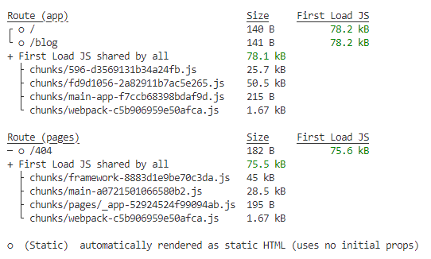

```js
async function getData() {
  const res = await fetch("https://dummyjson.com/products/?_limit=5");
  return await res.json();
}

const page = async () => {
  const data = await getData();
  console.log(data);
  return (
    <div>
      {data.products.map((phone) => {
        return (
          <div key={phone.id}>
            <p>{phone.title}</p>
          </div>
        );
      })}
    </div>
  );
};

export default page;
```

[Go to top:arrow_up: ](#top)

<a name='how_to_create_static_file_during_request_with_dynamic'></a>

### How to create static file during request with dynamic

---

- এখানে আইডিযুক্ত পেজটি রান টাইমে স্ট্যাটিক এইচটিএমএল তৈরী করে ব্রাউজারে পাঠোবে। কারণ নেক্সট জেএস জানেনা ইউজার কর্তৃক এখন কোন আইটেমে ক্লিক তার ডাটা রিকোয়েক্ট করবে।

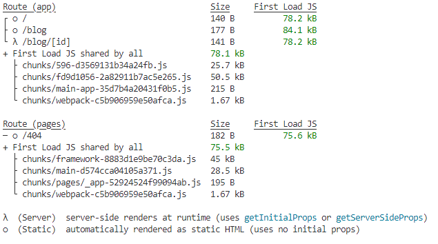

```js
//blog.js
import Link from "next/link";

async function getData() {
  const res = await fetch("https://dummyjson.com/products/?_limit=5");
  return await res.json();
}

const page = async () => {
  const data = await getData();

  return (
    <div>
      {data.products.map((phone) => {
        return (
          <div key={phone.id}>
            <Link href={`/blog/${phone.id}`}>
              <p>{phone.title}</p>
            </Link>
          </div>
        );
      })}
    </div>
  );
};

export default page;
```

```js
//[id].js
const page = async ({ params }) => {
  const { id } = params;
  const res = await fetch(`https://dummyjson.com/products/${id}`);
  const data = await res.json();

  return (
    <div>
      <p>{data.description}</p>
    </div>
  );
};

export default page;
```

[Go to top:arrow_up: ](#top)

<a name='installation_of_next_js'></a>

### Installaion:

---

```js
//install
npx create-next-app

//Run app
npm run dev

//Build app
npm run build
```

[Go to top:arrow_up: ](#top)

<a name='how-to-use-image-from-public-directory'></a>

### Use image from public directory

---

```js
import React from "react";

const page = () => {
  return (
    <div>
      
    </div>
  );
};

export default page;
```

[Go to top:arrow_up: ](#top)

<a name='how-use-global-css'></a>

### How to use global CSS ?

---

- Global css is accessable for any directory.
- In app directory stands - global.css
- Import this directory in layout.js as `import './globals.css'`

```js
//global.css
@tailwind base;
@tailwind components;
@tailwind utilities;

.test {
  background-color: aqua;
}

//page.js
import React from "react";

const page = () => {
  return (
    <div>
      <h1 className="test">I am tested by global css.</h1>
    </div>
  );
};

export default page;
```

[Go to top:arrow_up: ](#top)

<a name='how-to-use-module-css'></a>

### How to use module CSS ?

- module css work only for fixed moduel.
- Create `page.module.css` in app directory.
- Never write className with -, \_ or any special charecgter.
- Write css class:

```js
//page.module.css
.myText {
  background-color: aqua;
}
```

- For apply css import as `import styles from "./page.module.css";`
- Every style contain in styles as object.
- Write this className in element with dot notation form style object:

```js
import React from "react";
import styles from "./page.module.css";

const Page = () => {
  return (
    <div>
      <h1 className={`${styles.myText} ${styles.mySize}`}>
        I am tested by global css.
      </h1>
    </div>
  );
};

export default Page;
```

[Go to top:arrow_up: ](#top)

<a name='rules-of-client-side-rendering'></a>

### Rules of client side rendering

---

- When use React functionality as useEffect, useState etc its client side rendering.
- In client side rendering must write `use client` at upper.
- In client side rendering in view page source do not see data which fetch from api but see in console.

```js
"use client";
import React, { useEffect, useState } from "react";

const Page = () => {
  const [data, setData] = useState("");
  useEffect(() => {
    (async () => {
      const response = await fetch("https://dummyjson.com/products");
      const json = await response.json();
      setData(json["products"]);
    })();
  }, []);
  return <div>{console.log(data)}</div>;
};

export default Page;
```

[Go to top:arrow_up: ](#top)

<a name='rules-of-server-side-rendering'></a>

### Rules of server side rendering

---

- In server side rendering don't write `use client` at upper.
- In server side rendering in view page source see data which fetch from api but don't see in console.
- In server side rendering call api with asynchronous way and component also asynchronous way :

```js
const getData = async () => {
  const response = await fetch("https://dummyjson.com/products");
  const json = await response.json();
  return json["products"];
};

const page = async () => {
  const data = await getData();
  return (
    <div>
      {data.map((product) => (
        <div key={product.id}>
          <h1>{product.title}</h1>
        </div>
      ))}
    </div>
  );
};
export default page;
```

[Go to top:arrow_up: ](#top)

<a name='rules-of-using-both-csr-and-ssr'></a>

### Rules of using both SSR & CSR

---

- By using `use client` its possible to use CSR & SSR.
- But without using `use client` do not possible to use CSR & SSR. Only use SSR.

```js
"use client";
const getData = async () => {
  const response = await fetch("https://dummyjson.com/products");
  const json = await response.json();
  return json["products"];
};

const page = async () => {
  const data = await getData();
  return (
    <div>
      {data.map((product) => (
        <div key={product.id}>
          <h1>{product.title}</h1>
        </div>
      ))}
      //Client sidet render in button by onClick
      <button onClick={() => alert("Hello I am CSR.")}>Click Me</button>
    </div>
  );
};
export default page;
```

[Go to top:arrow_up: ](#top)

<a name='when-use-csr-and-when-use-ssr'></a>

### When use CSR and when use SSR?

---

### _Use client-side rendering when:_

- You need to fetch data after the initial page load or on user interactions.
- The data is not essential for SEO or can be crawled by search engines in other ways (e.g., via API routes or server-side rendering for critical content).
- You want to offload some processing from the server to the client, reducing the server load.
- You're building a dynamic and interactive user interface that needs to update without a full page refresh.

**_Common ways to implement CSR in Next.js:_**

- Using ` useEffect` and `useState` hooks to fetch and manage data on the client-side.
- Leveraging third-party data-fetching libraries like SWR or react-query for handling data synchronization and caching.

### _Use server-side rendering when::_

- You need to fetch data at request time, and the data changes frequently or is personalized for each user.
- SEO is a top priority, and you want to ensure search engines can index your content directly from the server-rendered HTML.
- You want to improve the initial page load performance by sending pre-rendered HTML to the client.

**_Common ways to implement SSR in Next.js:_**

- Using the `getServerSideProps` function for fetching data on the server-side before rendering the page.
- Using the `getInitialProps` lifecycle method for fetching data on the server-side. Note that this method disables automatic static optimization, so use it only when necessary.

[Go to top:arrow_up: ](#top)

<a name='basic-routing'></a>

### Basic Routing

---

- In app directory root `page.js` is by default home page. `http://localhost:3000`
- New route create means in app directory create folder and inside folder create `page.js`.
- As exampe In app directory create folder name `product` and inside folder create `page.js`. This router is `http://localhost:3000/product`

**_What is domain, segment and path?_**


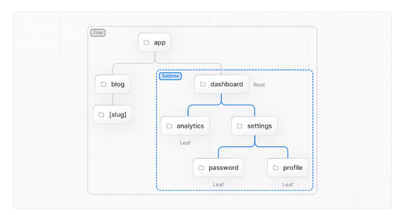
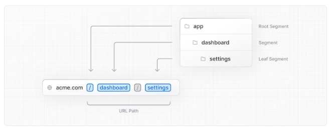

[Go to top:arrow_up: ](#top)

<a name='nested-routing'></a>

### Nested Routing

---

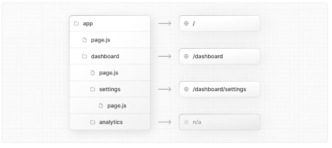

[Go to top:arrow_up: ](#top)

<a name='how-to-segment-in-routing'></a>

### How to skip segment in Routing/group rounting?

---

- Write segment name into () which you want to skip.
- Now in this picture your url:'http://localhost:3000/product/soap'

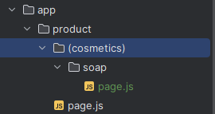

[Go to top:arrow_up: ](#top)

<a name='dynamic-routing'></a>

### Dynamic Routing

---

- Write segment in [] and addpe `page.js`
- By params props receive data from url.

```js
//Url: 'http://localhost:3000/cosmetics/soap'
const Page = ({ params }) => {
  return (
    <div>
      <h1>I am {params.name}</h1>
    </div>
  );
};

export default Page;
```

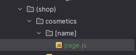

[Go to top:arrow_up: ](#top)

<a name='basic-link'></a>

### Basic Link

---

```js
//page.js
import Menu from "@/components/Menu";
import React from "react";

const page = () => {
  return (
    <div>
      <Menu />
      Home page
    </div>
  );
};

export default page;

//profile/page.js
import Menu from "@/components/Menu";
import React from "react";

const page = () => {
  return (
    <div>
      <Menu />
      Profile page
    </div>
  );
};

export default page;

//product/page.js
import React from "react";
import Menu from "@/components/Menu";

const page = () => {
  return (
    <div>
      <Menu />
      Product page
    </div>
  );
};

export default page;

//src/components/Menu.js
import Link from "next/link";
import React from "react";

const Menu = () => {
  return (
    <div className="flex space-x-5">
      <Link href={"/"}>Home</Link>
      <Link href={"/profile"}>Profile</Link>
      <Link href={"/product"}>Products</Link>
    </div>
  );
};

export default Menu;

```

[Go to top:arrow_up: ](#top)

<a name='use-next-progress-bar-libray'></a>

### Use next-nprogress-bar libray for showing loader

---

**_Installation:_**

```js
npm i next-nprogress-bar
```

```js
//layout.js
"use client";
import "./globals.css";
import { AppProgressBar as ProgressBar } from "next-nprogress-bar";

export default function RootLayout({ children }) {
  return (
    <html lang="en">
      <body className="">
        {children}
        <ProgressBar
          height="4px"
          color="#fffd00"
          options={{ showSpinner: false }}
          shallowRouting
        />
      </body>
    </html>
  );
}
```

[Go to top:arrow_up: ](#top)

<a name='how-to-style-active-link'></a>

### How to style active link?

---

- By `usePathname` recevive current path which click user.
- Then conditionally style link.

```js
"use client";
import Link from "next/link";
import React from "react";
import { usePathname } from "next/navigation";

const Menu = () => {
  const currentPath = usePathname();
  console.log(currentPath); //Show current path as '/' '/profile' etc
  return (
    <div className="flex space-x-5">
      <Link
        href={"/"}
        className={
          currentPath === "/" ? "text-red-600 font-bold" : "text-purple-900"
        }
      >
        Home
      </Link>
      <Link
        href={"/profile"}
        className={
          currentPath === "/profile"
            ? "text-red-600 font-bold"
            : "text-purple-900"
        }
      >
        Profile
      </Link>
      <Link
        href={"/product"}
        className={
          currentPath === "/product"
            ? "text-red-600 font-bold"
            : "text-purple-900"
        }
      >
        Products
      </Link>
    </div>
  );
};

export default Menu;
```

[Go to top:arrow_up: ](#top)

<a name='how-pass-query-string-with-link-and-how-to-receive'></a>

### How to Pass query string with link and how to receive?

---

**_Pass Query:_**

- When pass query string with link write `href` as below as object.
- Then the url build as: `http://localhost:3000/product?name=Lux&price=90+TK`

```js
//product.js
"use client";
import Link from "next/link";
import React from "react";

const Menu = () => {
  return (
    <div className="flex space-x-5">
      <Link
        href={{ pathname: "/product", query: { name: "Lux", price: "90 TK" } }}
      >
        Products
      </Link>
    </div>
  );
};

export default Menu;
```

**_Receive Query with built in `searchParams`:_**

- In default `searchParams` contain query string as object.

```js
//product/page.js
import React from "react";
import Menu from "@/components/Menu";

const page = ({ searchParams }) => {
  return (
    <div>
      <Menu />
      Product page
      <h1>{searchParams.name}</h1>
      <h1>{searchParams.price}</h1>
    </div>
  );
};

export default page;
```

**_Receive Query with navigation `useSearchParams`:_**

```js
"use client";
import React from "react";
import Menu from "@/components/Menu";
import { useSearchParams } from "next/navigation";

const page = () => {
  const params = useSearchParams();
  return (
    <div>
      <Menu />
      Product page
      <h1>{params.get("name")}</h1>
      <h1>{params.get("price")}</h1>
    </div>
  );
};

export default page;
```

[Go to top:arrow_up: ](#top)

<a name='link-replace-property'></a>

### Link - replace property

---

- By default browser save routing history when user navigate one route to another router.
- After navigate many route user go previous or forward route without loading.
- If use `replace` key word in link browser do not save routing history.

```js
"use client";
import Link from "next/link";
import React from "react";
import { usePathname } from "next/navigation";

const Menu = () => {
  const currentPath = usePathname();

  return (
    <div className="flex space-x-5">
      <Link href={"/"} replace>
        Home
      </Link>
      <Link href={"/profile"} replace>
        Profile
      </Link>
      <Link
        href={{ pathname: "/product", query: { name: "Lux", price: "90 TK" } }}
        replace
      >
        Products
      </Link>
    </div>
  );
};

export default Menu;
```

[Go to top:arrow_up: ](#top)

<a name='what-is-use-router-hook'></a>

### What is useRouter hook and detail about this methods?

---

- In Next.js, the useRouter is a hook provided by the next/router module.
- It gives you access to the Next.js router object, which allows you to interact with the routing system of your application.
- The router object provides information about the current route, query parameters, and methods to programmatically navigate between pages

**_Details about mehod of useRouter:_**

- `push` & `replace` methods is used to programmatically navigate to a different page.
- Its allows you to navigate to a specified URL and optionally include query parameters and other options.
- `push` can save routing history.
- `replace` method can not save routing history.
- In `push` and `replace` method can pass query string.
- `forward` method use to naviagate imidiate forward router.
- `back` method use to naviagate imidiate backword router.
- `refresh` method use to refresh current router.

```js
"use client";
import Menu from "@/components/Menu";
import React from "react";
import { useRouter } from "next/navigation";

const page = () => {
  const router = useRouter();

  return (
    <div>
      <Menu />
      Home page
      <div className="flex flex-col space-y-0">
        <button onClick={() => router.push("/product")}>
          Go to product Page
        </button>
        <button onClick={() => router.replace("/profile")}>
          Go to profile page
        </button>
        <button onClick={() => router.forward()}>Forward</button>
        <button onClick={() => router.back()}>Backward</button>
        <button onClick={() => router.refresh()}>Refresh</button>

        {/* with query parameter */}
        <button onClick={() => router.push("/product?name=Lux&price=120")}>
          Go Product page with query
        </button>
      </div>
    </div>
  );
};

export default page;
```

[Go to top:arrow_up: ](#top)

<a name='master-layout-concept'></a>

### Master Layout concept

---

- In Next.js, a master layout refers to a common layout structure that you can apply to multiple pages in your application.
- This is especially useful for elements like headers, navigation menus, sidebars, font-family and footers that remain consistent across various pages.
- Master layout name must `RootLayout` and he wraped with html and pass body.
- By children prop all component pass in app.
- Its location in app as root `layout.js`.

```js
//app/layout.js
"use client";
import "./globals.css";

export default function RootLayout({ children }) {
  return (
    <html lang="en">
      <body className="">{children}</body>
    </html>
  );
}
```

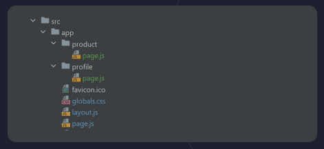

[Go to top:arrow_up: ](#top)

<a name='directory-based-layout'></a>

### Directory based layout

- In directory create a file name `layout.js`
- Create layout as below.
- Now this layout work only for this directory.

```js
import React from "react";

const Layout = ({ children }) => {
  return (
    <div>
      <h1>I am all in profile page</h1>
      {children}
    </div>
  );
};

export default Layout;
```

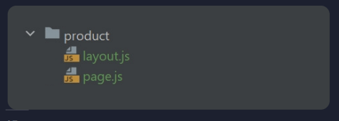

[Go to top:arrow_up: ](#top)

<a name='how-to-create-multiple-root-layout'></a>

### How to create multiple root layout

---

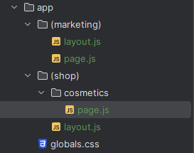

- Delete root `layout.js` and `page.js` from app directory
- Create group route as picture e.g: `(marketing)` and `(shop)`
- Inside this two group route create individual `layout.js` as below:

```js
// app/marketing/layout.js
import Head from "next/head";

const MarketingLayout = ({ children }) => (
  <html>
    <Head>{/* Add head metadata */}</Head>
    <body>
      {/* Add marketing-specific content */}
      {children}
    </body>
  </html>
);

export default MarketingLayout;
```

```js
// app/shop/layout.js
import Head from "next/head";

const ShopLayout = ({ children }) => (
  <html>
    <Head>{/* Add head metadata */}</Head>
    <body>
      {/* Add shop-specific content */}
      {children}
    </body>
  </html>
);

export default ShopLayout;
```

- In any group layout define `page.js` from homepage. e.g: in `marketing` create `page.js` this is homepage. so this work as homepage.
- In `shop` define `cosemtics` segment so this work with url: '/cosmetics/

[Go to top:arrow_up: ](#top)

<a name='not-found-directory'></a>

### not-found directory

---

- The `not-found.js` file handles any unmatched URLs for your whole application.
- The `not-found.js` file is used to render UI when the notFound function is thrown within a route segment.
- Along with serving a custom UI, Next.js will also return a 404 HTTP status code.
- `not-found.js` components do not accept any props.
- Its create in app as root directory and works for whole application.

```js
import React from "react";
const NotFound = () => {
  return (
    <div>
      <h1>Not found this page!</h1>
    </div>
  );
};
export default NotFound;
```


[Go to top:arrow_up: ](#top)

<a name='error-directory'></a>

### error.js directory

---

- It is useful for catching unexpected errors that occur in Server Components and Client Components and displaying a fallback UI
- error.js boundaries must be Client Components.
- In Production builds, errors forwarded from Server Components will be stripped of specific error details to avoid leaking sensitive
  information.
- Its working as app root directory for whole application or specific directory.

```js
import Menu from "@/components/Menu";
import React from "react";

const page = () => {
  console.log(props);
  return (
    <div>
      <Menu />
      Profile page
    </div>
  );
};

export default page;
```

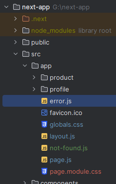

[Go to top:arrow_up: ](#top)

<a name='loading-directory'></a>

### loading.js directive

---

- A loading file can create instant loading states built
- By default, this file is a Server Component
- Can also be used as a Client Component through the "use client" directive
- Loading UI components do not accept any parameters.
- Its working as app root directory for whole application or specific directory.

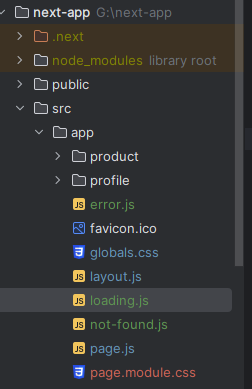

[Go to top:arrow_up: ](#top)

<a name='route-directory'></a>

### route.js directory

---

- Route Handlers allow you to create custom request handlers for a given route using the Web Request and Response
- HTTP methods are supported: GET, POST, PUT, PATCH, DELETE, HEAD, and OPTIONS
- Use to manage back-end
- `api` folder contain `route.js` directory.

```js
import {NextResponse} from 'next/server'

export const GET = async () => {
    return NextResponse.json({message:'Hello I am response from server'})
}

//url: http://localhost:3000/profile/api
//response:
{
  "message": "Hello I am response from server"
}
```

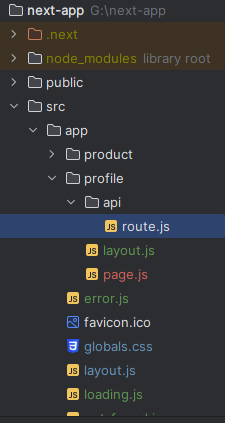

[Go to top:arrow_up: ](#top)

<a name='process-of-data-fatching-by-ssr'></a>

### Process of Data fetching by SSR

---

```js
async function getData() {
  const res = await fetch("https://dummyjson.com/products/1");
  return await res.json();
}
const Page = async () => {
  const data = await getData();
  return <div>{JSON.stringify(data)}</div>;
};

export default Page;
```

[Go to top:arrow_up: ](#top)

<a name='process-of-data-fatching-by-csr'></a>

### Process of Data fetching by CSR

---

```js
"use client";
import React, { useEffect, useState } from "react";

const page = () => {
  const [data, setData] = useState(null);
  useEffect(() => {
    (async () => {
      const res = await fetch("https://dummyjson.com/products/1");
      const data = await res.json();
      setData(data);
    })();
  }, []);
  return <div>{JSON.stringify(data)}</div>;
};
export default page;
```

[Go to top:arrow_up: ](#top)

<a name='data-fatching-by-synchronous-way'></a>

### Data factching by sychronous way

---

### Synchronous way

---

```js
const getUser = async () => {
  const res = await fetch("https://dummyjson.com/users");
  return res.json();
};

const getProducts = async () => {
  const res = await fetch("https://dummyjson.com/products");
  return res.json();
};

const page = async () => {
  const products = await getProducts();
  const users = await getUser();
  const user = users.users.map((user) => {
    return (
      <div key={user.id}>
        <p>{`${user.firstName} ${user.lastName}`}</p>
      </div>
    );
  });
  const product = products.products.map((product) => {
    return (
      <div key={user.id}>
        <p>{product.title}</p>
      </div>
    );
  });
  return (
    <div className="flex space-x-8">
      <div className="bg-slate-300">{user}</div>
      <div className="bg-orange-500">{product}</div>
    </div>
  );
};

export default page;
```

[Go to top:arrow_up: ](#top)

<a name='data-fatching-by-peralal'></a>

## Peralal data fatching

---

- Same time fatch data

```js
const getUser = async () => {
  const res = await fetch("https://dummyjson.com/users");
  return res.json();
};

const getProducts = async () => {
  const res = await fetch("https://dummyjson.com/products");
  return res.json();
};

const page = async () => {
  const products = getProducts();
  const users = getUser();
  const [productData, userData] = await Promise.all([products, users]);

  const user = userData.users.map((user) => {
    return (
      <div key={user.id}>
        <p>{`${user.firstName} ${user.lastName}`}</p>
      </div>
    );
  });
  const product = productData.products.map((product) => {
    return (
      <div key={user.id}>
        <p>{product.title}</p>
      </div>
    );
  });
  return (
    <div className="flex space-x-8">
      <div className="bg-slate-300">{user}</div>
      <div className="bg-orange-500">{product}</div>
    </div>
  );
};

export default page;
```

[Go to top:arrow_up: ](#top)

<a name='how-to-use-basePath'></a>

### next.config - How to use basepath?

---

```js
const nextConfig = {
  basePath: "/basePathName",
};

//http://localhost:3000/basePathName
```

[Go to top:arrow_up: ](#top)

<a name='how-to-use-env'></a>

### next.config - How to use env?

---

```js
const nextConfig = {
  env: {
    BASE_URL: "https://dummyjson.com",
  },
};

//use if file
const getUser = async () => {
  const res = await fetch(`${process.env.BASE_URL}/users`);
  return res.json();
};
```

[Go to top:arrow_up: ](#top)

<a name='how-to-set-response-header'></a>

## next.config - How to set response headers?

- determine single path or whole application by `source: "/:path*"`

```js
const nextConfig = {
  async headers() {
    return [
      {
        source: "/",
        headers: [
          {
            key: "keyName",
            value: "valueName",
          },
        ],
      },
    ];
  },
};
```

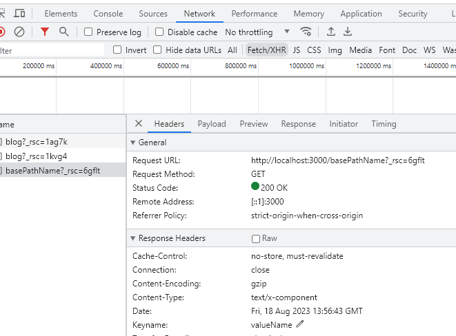

[Go to top:arrow_up: ](#top)

<a name='how-to-set-x-frame'></a>

## next.config - How to set X-Frame option header?

---

- This header indicates whether the site should be allower to be displayed withing an iframe.
- This can prevent against clickjaking attacks.

```js
const nextConfig = {
  //By this possible to show in iframe
{
  key:'X-Frame-options,
  value:'SAMEORIGIN'
}

//By this can't possible to show in iframe
{
  key:'X-Frame-options,
  value:'DENY'
}
};
```

[Go to top:arrow_up: ](#top)

<a name='content-Security-Policy-header'></a>

### next.config - Content-Security-Policy header

---

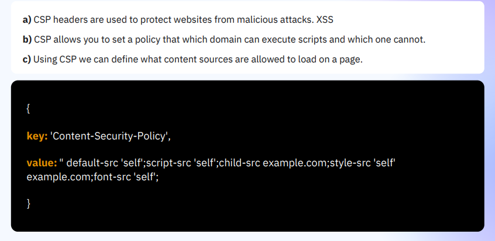

[Go to top:arrow_up: ](#top)

<a name='permission-policy-header'></a>

### next.config - Permission-policy header

---

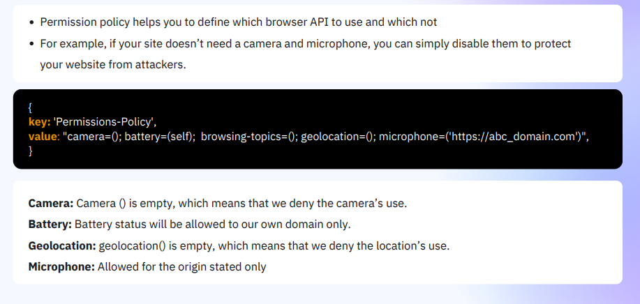

[Go to top:arrow_up: ](#top)

<a name='Strict-Transport-Security'></a>

### next.config - Strict-Transport-Security

---

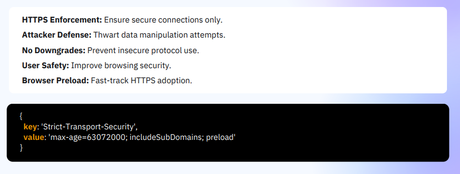

[Go to top:arrow_up: ](#top)

<a name='X-Content-Type-Options'></a>

### next.config - X-Content-Type-Options

---

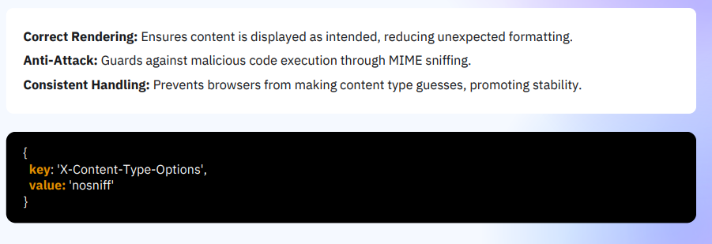

[Go to top:arrow_up: ](#top)

<a name='Powered By'></a>

### next.config - Powered By

---

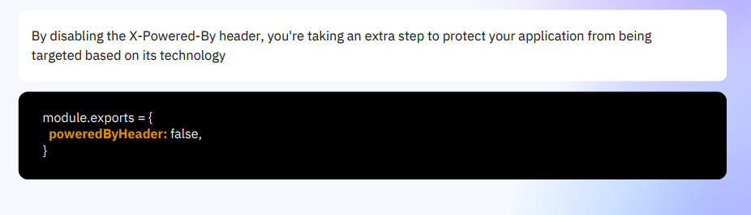

[Go to top:arrow_up: ](#top)

<a name='Dist-Dir-Name'></a>

### next.config - Dist Dir Name

---

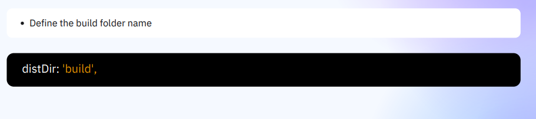

[Go to top:arrow_up: ](#top)

<a name='Connection'></a>

### next.config - Connection

---

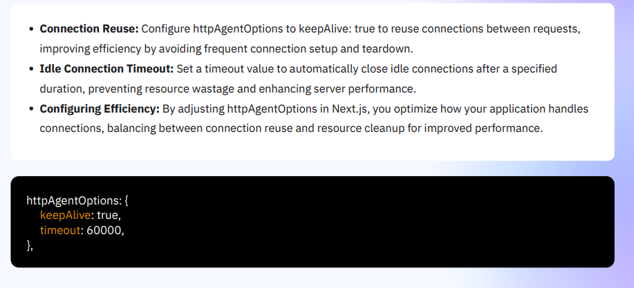

[Go to top:arrow_up: ](#top)

<a name='Browser-Source-Maps'></a>

### next.config - Browser Source Maps

---


[Go to top:arrow_up: ](#top)

<a name='Trailing-Slash'></a>

### next.config - Trailing Slash

---

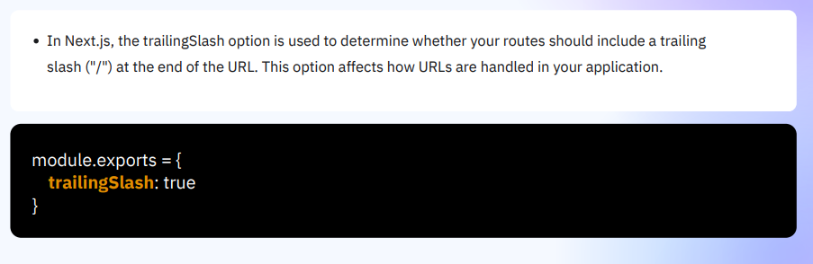

[Go to top:arrow_up: ](#top)

<a name='IMAGE-OPTIMIZATION'></a>

### IMAGE OPTIMIZATION

---

- Next.js provides an Image component as part of its built-in image optimization system.
- This system helps to improve performance by optimizing image loading for your application

- Automatic Optimization: Images are optimized on-demand, as users request them.
- Responsive: Different sizes and resolutions of images can be generated according to the
  viewing device and screen size.
- Efficient: Images are served in modern formats like WebP when the browser supports it.
- Lazy-Loading: Offscreen images are not loaded until they come into the viewport, saving
  bandwidth.

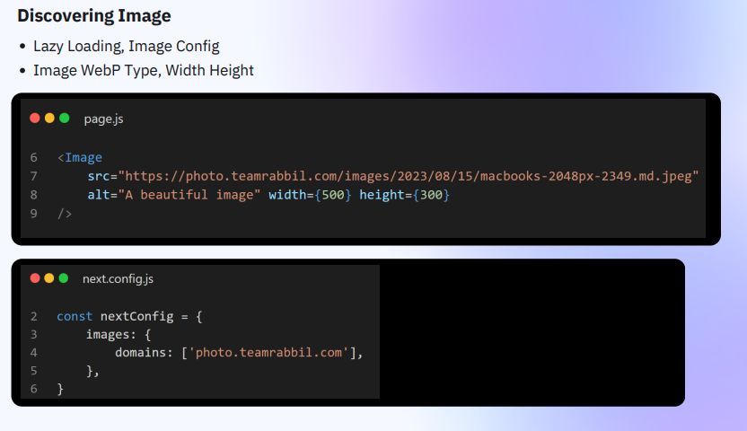
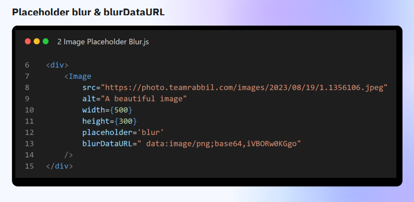
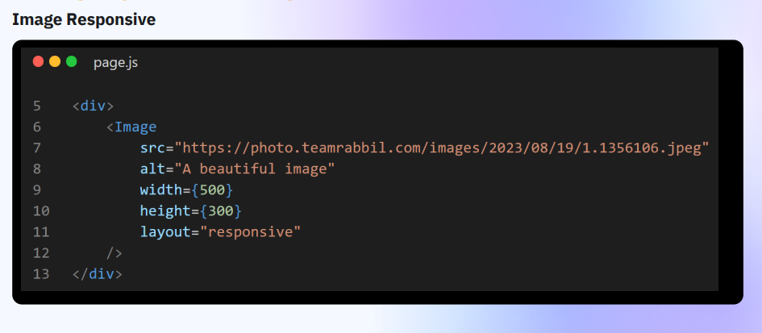
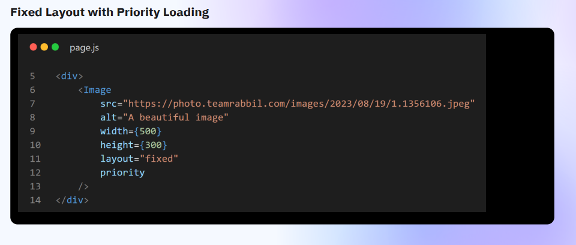

[Go to top:arrow_up: ](#top)

<a name='Google-Font-Inside'></a>

### Google Font Inside Next.JS

---

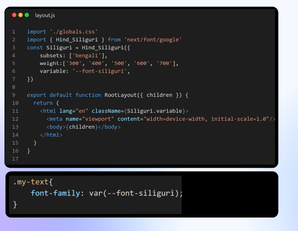

[Go to top:arrow_up: ](#top)

<a name='Local-Font-Inside'></a>

### Local Font Inside Next.JS

---

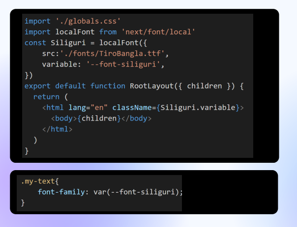
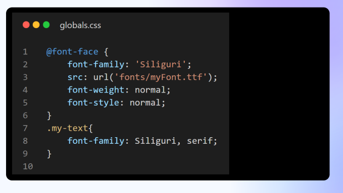

[Go to top:arrow_up: ](#top)

<a name='SCRIPT'></a>

### SCRIPT OPTIMIZATION

---

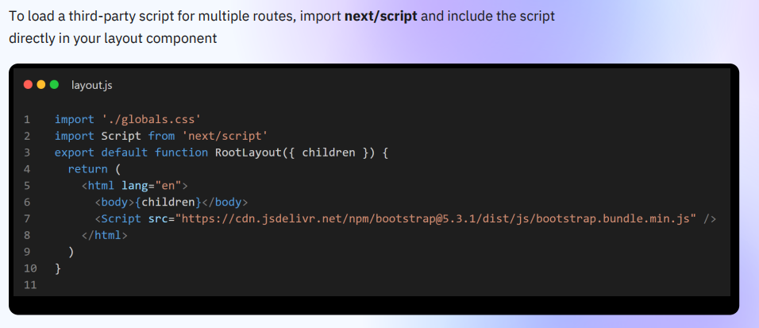

[Go to top:arrow_up: ](#top)

<a name='STATIC-ASSETS'></a>

### STATIC ASSETS OPTIMIZATION

---

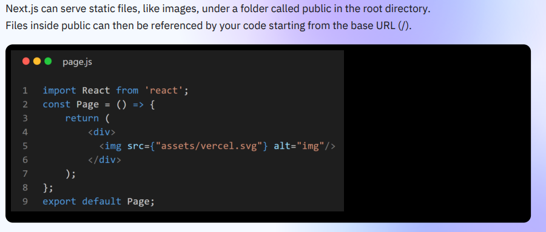

[Go to top:arrow_up: ](#top)

<a name='LAZY-LOADING'></a>

### LAZY LOADING

---

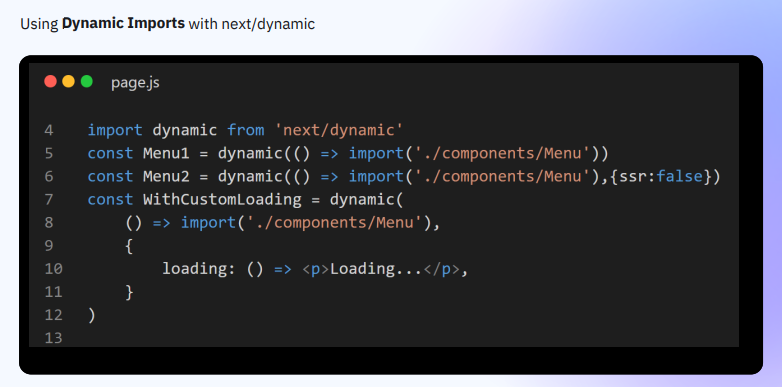

[Go to top:arrow_up: ](#top)

<a name='simple-request-and-response'></a>

### Backend - simple request and response

---

```js
//api/profile/route.js
//localhost://3000/api/profile
import { NextResponse } from "next/server";

export async function GET(req, res) {
  return NextResponse.json({ message: "I am GET Method" });
}
export async function POST(req, res) {
  return NextResponse.json({ message: "I am POST Method" });
}
export async function PUT(req, res) {
  return NextResponse.json({ message: "I am PUT Method" });
}
export async function DELETE(req, res) {
  return NextResponse.json({ message: "I am DELETE Method" });
}
```

[Go to top:arrow_up: ](#top)

<a name='Working-with-request-url-params'></a>

### Backend - Working with request url params

---

```js
//URL={{BASE_URL}}/profile?id=3456&userName=Anamul Haque
import { NextResponse } from "next/server";

export async function GET(req, res) {
  const { searchParams } = new URL(req.url); //Create new URL with passing req url and destructure searchParams form URL
  const id = searchParams.get("id");         //Receive id and name from params
  const name = searchParams.get("userName");
  return NextResponse.json({ id: id, name: name });
}
// Result
{
    "id": "3456",
    "name": "Anamul Haque"
}
```

[Go to top:arrow_up: ](#top)

<a name='Working-with-request-body-with-json-data'></a>

### Backend - Working with request body with json data

```js
import { NextResponse } from "next/server";

export async function POST(req, res) {
  const body = await req.json(); //return json object
  const name = body.name;
  const age = body.age;
  return NextResponse.json({ name: name, age: age });
}
//Result:
{
    "name": "Anamul Haque",
    "age": 30
}
```

[Go to top:arrow_up: ](#top)

<a name='Working-with-request-body-with-formData'></a>

### Backend - Working with request body with formData

```js
import { NextResponse } from "next/server";

export async function POST(req, res) {
  const body = await req.formData();
  const name = body.get("name");
  const age = body.get("age");
  return NextResponse.json({ name: name, age: age });
}
//Result:
{
    "name": "Anamul Haque",
    "age": 30
}
```

[Go to top:arrow_up: ](#top)

<a name='Working-with-request-headers'></a>

### Backend - Working with request headers

```js
import { NextResponse } from "next/server";
import { headers } from "next/headers";

export async function GET(req, res) {
  const headersList = headers();
  const token = headersList.get("Authorization");
  return NextResponse.json({ token });
}
```

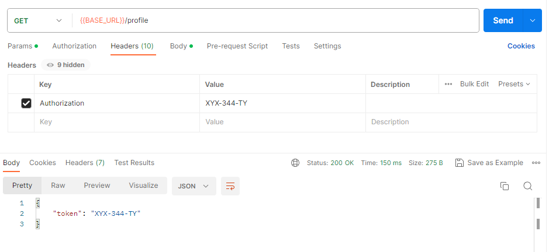

[Go to top:arrow_up: ](#top)

<a name='Working-with-request-cookies'></a>

### Backend - Working with request cookies

**_Set cookies in postmen_**

- Click cookies.
- Add domain name as 'http://localhost:3000/api'
- Finally set cookie as below image:
  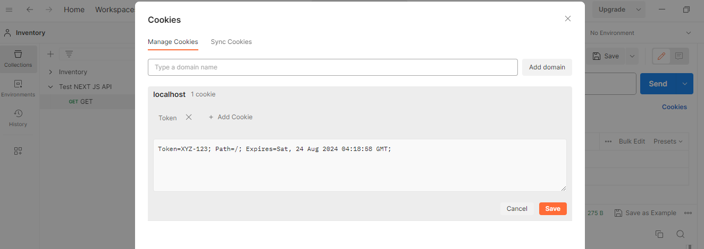

**_Receive cookie_**

```js
import { NextResponse } from "next/server";

export async function GET(req, res) {
  const Token = req.cookies.get("Token");
  return NextResponse.json({ Token });
}
//Result:
{
    "Token": {
        "name": "Token",
        "value": "XYZ-123"
    }
}
```

[Go to top:arrow_up: ](#top)

<a name='How-to-set-custom-status-code'></a>

### Backend - How to set custom status code

--

```js
import { NextResponse } from "next/server";

export async function GET(req, res) {
  return NextResponse.json({ Message: "Hello world" }, { status: 500 }); //As separate object
}

//If respone body array of object
return NextResponse.json(
  [{ Message: "Hello world" }, { msg2: "Hello second message" }],
  { status: 500 }
);
```

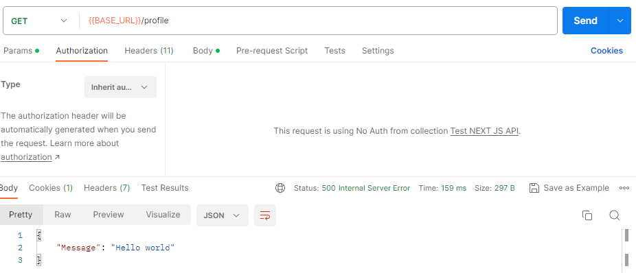

[Go to top:arrow_up: ](#top)

<a name='set-cookies-in-headers-with-response'></a>

### Backend - How to set cookies in headers with response

```js
import { NextResponse } from "next/server";

export async function POST(req, res) {
  return NextResponse.json(
    { status: true, message: "Request completed" },
    {
      status: 201,
      headers: { "Set-Cookie": `token=XYZ-123-ABC; Path=/` },
    }
  );
}
```

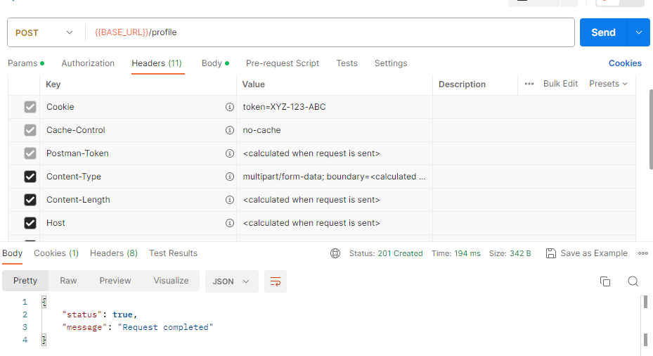

[Go to top:arrow_up: ](#top)

<a name='set-token-in-headers-with-response'></a>

### Backend - How to set token in headers with response

```js
import { NextResponse } from "next/server";

export async function POST(req, res) {
  return NextResponse.json(
    { status: true, message: "Request completed" },
    {
      status: 201,
      headers: { token: "XYZ-123" },
    }
  );
}
```

[Go to top:arrow_up: ](#top)

<a name='How-to-red-rect'></a>

### Backend - How to redirect

```js
import { redirect } from "next/navigation";

export async function GET(req, res) {
  redirect("/");
}
```

[Go to top:arrow_up: ](#top)

<a name='Apply-Mutiple-path-in-middleware'></a>

### Apply Mutiple path in middleware.js

- middleware.js is app root directory.

```js
import { NextResponse } from "next/server";
import { NextRequest } from "next/server";

export function middleware(req) {
  console.log("I am middleware ");
  console.log(req.method);
  console.log(req.url);
  return NextResponse.next();
}
export const config = {
  matcher: ["/about/:path*", "/dashboard/:path*"],
};
```

[Go to top:arrow_up: ](#top)

<a name='Conditional-statement-on-middleware'></a>

### Conditional statement on middleware.js

```js
import { NextResponse } from "next/server";
import { NextRequest } from "next/server";

export function middleware(req) {
  if (req.nextUrl.pathname.startsWith("/api/example1")) {
    console.log("example1");
    return NextResponse.next();
  }
  if (req.nextUrl.pathname.startsWith("/api/example2")) {
    console.log("example2");
    return NextResponse.next();
  }
}
```

[Go to top:arrow_up: ](#top)

<a name='Setting-Header-with-Request-in-middleware'></a>

### Setting Header with Request in middleware.js

```js
import { NextResponse } from "next/server";
import { NextRequest } from "next/server";

export function middleware(req) {
  if (req.nextUrl.pathname.startsWith("/api/example1")) {
    const requestHeaders = new Headers(req.headers);
    requestHeaders.set("Token", "example1-XYZ-ABC");

    return NextResponse.next({
      request: { headers: requestHeaders },
    });
  }
  if (req.nextUrl.pathname.startsWith("/api/example2")) {
    const requestHeaders = new Headers(req.headers);
    requestHeaders.set("Token", "example2-XYZ-ABC");

    return NextResponse.next({
      request: { headers: requestHeaders },
    });
  }
}
```

[Go to top:arrow_up: ](#top)

<a name='Setting-Header-with-response-in-middleware'></a>

### Setting Header with response in middleware.js

```js
import { NextResponse } from "next/server";
import { NextRequest } from "next/server";

export function middleware(req, res) {
  if (req.nextUrl.pathname.startsWith("/api/example1")) {
    const response = NextResponse.next();
    response.headers.set("Token", "example1-XYZ-ABC");
    return response;
  }
  if (req.nextUrl.pathname.startsWith("/api/example2")) {
    const response = NextResponse.next();
    response.headers.set("Token", "example2-XYZ-ABC");
    return response;
  }
}
```

[Go to top:arrow_up: ](#top)
