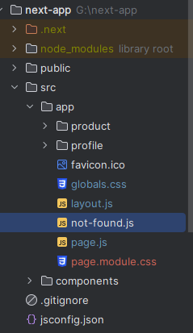

## Next JS Documentation

| No  | Content                                                                |
| --- | ---------------------------------------------------------------------- |
| 1.  | [Installation of next js](#installation)                               |
| 2.  | [How to use image from public directory?](#publicDir)                  |
| 2.  | [How to use global CSS?](#globalCSS)                                   |
| 2.  | [How to use module CSS?](#moduleCSS)                                   |
| 2.  | [Rules of client side rendering.](#css)                                |
| 2.  | [Rules of server side rendering](#ssr)                                 |
| 2.  | [Rules of using both SSR & CSR](#ssrCsr)                               |
| 2.  | [When use CSR and when use SSR?](#rule)                                |
| 2.  | [Basic Routing](#basicRouting)                                         |
| 2.  | [Nested Routing](#nestedRouting)                                       |
| 2.  | [Basic Link](#basicLink)                                               |
| 2.  | [Use next-nprogress-bar libray for showing loader.](#loader)           |
| 2.  | [How to style active link?.](#activeLink)                              |
| 2.  | [How to Pass query string with link and how to receive?](#queryString) |
| 2.  | [Link-replace property](#replace)                                      |
| 2.  | [Link-prefetch property](#prefetch)                                    |
| 2.  | [What is useRouter hook?](#useRouter)                                  |
| 2.  | [Master Layout concept](#masterLayout)                                 |
| 2.  | [Directory based layout](#directoryLayout)                             |
| 2.  | [not-found.js directory](#notFound)                                    |
| 2.  | [error.js directory](#errorHandle)                                     |
| 2.  | [loading.js directory](#loading)                                       |
| 2.  | [route.js directory](#route)                                           |
| 2.  | [Process of Data fetching by SSR](#ssrDataFetch)                       |
| 2.  | [Process Data fetching by CSR](#csrDataFetch)                          |

### Installaion:

---

```js
//install
npx create-next-app@latest

//Run app
npm run dev

//Build app
npm run build
```

### Use image from public directory

---

```js
import React from "react";

const page = () => {
  return (
    <div>
      
    </div>
  );
};

export default page;
```

### How to use global CSS ?

---

- Global css is accessable for any directory.
- In app directory stands - global.css
- Import this directory in layout.js as `import './globals.css'`

```js
//global.css
@tailwind base;
@tailwind components;
@tailwind utilities;

.test {
  background-color: aqua;
}

//page.js
import React from "react";

const page = () => {
  return (
    <div>
      <h1 className="test">I am tested by global css.</h1>
    </div>
  );
};

export default page;
```

### How to use module CSS ?

- module css work only for fixed moduel.
- Create `page.module.css` in app directory.
- Never write className with -, \_ or any special charecgter.
- Write css class:

```js
//page.module.css
.myText {
  background-color: aqua;
}
```

- For apply css import as `import styles from "./page.module.css";`
- Every style contain in styles as object.
- Write this className in element with dot notation form style object:

```js
import React from "react";
import styles from "./page.module.css";

const Page = () => {
  return (
    <div>
      <h1 className={`${styles.myText} ${styles.mySize}`}>
        I am tested by global css.
      </h1>
    </div>
  );
};

export default Page;
```

### Rules of client side rendering

- When use React functionality as useEffect, useState etc its client side rendering.
- In client side rendering must write `use client` at upper.
- In client side rendering in view page source do not see data which fetch from api but see in console.

```js
"use client";
import React, { useEffect, useState } from "react";

const Page = () => {
  const [data, setData] = useState("");
  useEffect(() => {
    (async () => {
      const response = await fetch("https://dummyjson.com/products");
      const json = await response.json();
      setData(json["products"]);
    })();
  }, []);
  return <div>{console.log(data)}</div>;
};

export default Page;
```

### Rules of server side rendering

---

- In server side rendering don't write `use client` at upper.
- In server side rendering in view page source see data which fetch from api but don't see in console.
- In server side rendering call api with asynchronous way and component also asynchronous way :

```js
const getData = async () => {
  const response = await fetch("https://dummyjson.com/products");
  const json = await response.json();
  return json["products"];
};

const page = async () => {
  const data = await getData();
  return (
    <div>
      {data.map((product) => (
        <div key={product.id}>
          <h1>{product.title}</h1>
        </div>
      ))}
    </div>
  );
};
export default page;
```

### Rules of using both SSR & CSR

---

- By using `use client` its possible to use CSR & SSR.
- But without using `use client` do not possible to use CSR & SSR. Only use SSR.

```js
"use client";
const getData = async () => {
  const response = await fetch("https://dummyjson.com/products");
  const json = await response.json();
  return json["products"];
};

const page = async () => {
  const data = await getData();
  return (
    <div>
      {data.map((product) => (
        <div key={product.id}>
          <h1>{product.title}</h1>
        </div>
      ))}
      //Client sidet render in button by onClick
      <button onClick={() => alert("Hello I am CSR.")}>Click Me</button>
    </div>
  );
};
export default page;
```

### When use CSR and when use SSR?

---

### _Use client-side rendering when:_

- You need to fetch data after the initial page load or on user interactions.
- The data is not essential for SEO or can be crawled by search engines in other ways (e.g., via API routes or server-side rendering for critical content).
- You want to offload some processing from the server to the client, reducing the server load.
- You're building a dynamic and interactive user interface that needs to update without a full page refresh.

**_Common ways to implement CSR in Next.js:_**

- Using ` useEffect` and `useState` hooks to fetch and manage data on the client-side.
- Leveraging third-party data-fetching libraries like SWR or react-query for handling data synchronization and caching.

### _Use server-side rendering when::_

- You need to fetch data at request time, and the data changes frequently or is personalized for each user.
- SEO is a top priority, and you want to ensure search engines can index your content directly from the server-rendered HTML.
- You want to improve the initial page load performance by sending pre-rendered HTML to the client.

**_Common ways to implement SSR in Next.js:_**

- Using the `getServerSideProps` function for fetching data on the server-side before rendering the page.
- Using the `getInitialProps` lifecycle method for fetching data on the server-side. Note that this method disables automatic static optimization, so use it only when necessary.

### Basic Routing

---

- In app directory root `page.js` is by default home page. `http://localhost:3000`
- New route create means in app directory create folder and inside folder create `page.js`.
- As exampe In app directory create folder name `product` and inside folder create `page.js`. This router is `http://localhost:3000/product`

### Nested Routing

---


### Basic Link

---

```js
//page.js
import Menu from "@/components/Menu";
import React from "react";

const page = () => {
  return (
    <div>
      <Menu />
      Home page
    </div>
  );
};

export default page;

//profile/page.js
import Menu from "@/components/Menu";
import React from "react";

const page = () => {
  return (
    <div>
      <Menu />
      Profile page
    </div>
  );
};

export default page;

//product/page.js
import React from "react";
import Menu from "@/components/Menu";

const page = () => {
  return (
    <div>
      <Menu />
      Product page
    </div>
  );
};

export default page;

//src/components/Menu.js
import Link from "next/link";
import React from "react";

const Menu = () => {
  return (
    <div className="flex space-x-5">
      <Link href={"/"}>Home</Link>
      <Link href={"/profile"}>Profile</Link>
      <Link href={"/product"}>Products</Link>
    </div>
  );
};

export default Menu;

```

### Use next-nprogress-bar libray for showing loader

---

**_Installation:_**

```js
npm i next-nprogress-bar
```

```js
//layout.js
"use client";
import "./globals.css";
import { AppProgressBar as ProgressBar } from "next-nprogress-bar";

export default function RootLayout({ children }) {
  return (
    <html lang="en">
      <body className="">
        {children}
        <ProgressBar
          height="4px"
          color="#fffd00"
          options={{ showSpinner: false }}
          shallowRouting
        />
      </body>
    </html>
  );
}
```

### How to style active link?

---

- By `usePathname` recevive current path which click user.
- Then conditionally style link.

```js
"use client";
import Link from "next/link";
import React from "react";
import { usePathname } from "next/navigation";

const Menu = () => {
  const currentPath = usePathname();
  console.log(currentPath); //Show current path as '/' '/profile' etc
  return (
    <div className="flex space-x-5">
      <Link
        href={"/"}
        className={
          currentPath === "/" ? "text-red-600 font-bold" : "text-purple-900"
        }
      >
        Home
      </Link>
      <Link
        href={"/profile"}
        className={
          currentPath === "/profile"
            ? "text-red-600 font-bold"
            : "text-purple-900"
        }
      >
        Profile
      </Link>
      <Link
        href={"/product"}
        className={
          currentPath === "/product"
            ? "text-red-600 font-bold"
            : "text-purple-900"
        }
      >
        Products
      </Link>
    </div>
  );
};

export default Menu;
```

### How to Pass query string with link and how to receive?

---

**_Pass Query:_**

- When pass query string with link write `href` as below as object.
- Then the url build as: `http://localhost:3000/product?name=Lux&price=90+TK`

```js
//product.js
"use client";
import Link from "next/link";
import React from "react";

const Menu = () => {
  return (
    <div className="flex space-x-5">
      <Link
        href={{ pathname: "/product", query: { name: "Lux", price: "90 TK" } }}
      >
        Products
      </Link>
    </div>
  );
};

export default Menu;
```

**_Receive Query with built in `searchParams`:_**

- In default `searchParams` contain query string as object.

```js
//product/page.js
import React from "react";
import Menu from "@/components/Menu";

const page = ({ searchParams }) => {
  return (
    <div>
      <Menu />
      Product page
      <h1>{searchParams.name}</h1>
      <h1>{searchParams.price}</h1>
    </div>
  );
};

export default page;
```

**_Receive Query with navigation `useSearchParams`:_**

```js
"use client";
import React from "react";
import Menu from "@/components/Menu";
import { useSearchParams } from "next/navigation";

const page = () => {
  const params = useSearchParams();
  return (
    <div>
      <Menu />
      Product page
      <h1>{params.get("name")}</h1>
      <h1>{params.get("price")}</h1>
    </div>
  );
};

export default page;
```

### Link - replace property

---

- By default browser save routing history when user navigate one route to another router.
- After navigate many route user go previous or forward route without loading.
- If use `replace` key word in link browser do not save routing history.

```js
"use client";
import Link from "next/link";
import React from "react";
import { usePathname } from "next/navigation";

const Menu = () => {
  const currentPath = usePathname();

  return (
    <div className="flex space-x-5">
      <Link href={"/"} replace>
        Home
      </Link>
      <Link href={"/profile"} replace>
        Profile
      </Link>
      <Link
        href={{ pathname: "/product", query: { name: "Lux", price: "90 TK" } }}
        replace
      >
        Products
      </Link>
    </div>
  );
};

export default Menu;
```

### Link-prefetch property

---

### What is useRouter hook?

---

- In Next.js, the useRouter is a hook provided by the next/router module.
- It gives you access to the Next.js router object, which allows you to interact with the routing system of your application.
- The router object provides information about the current route, query parameters, and methods to programmatically navigate between pages

**_Details about mehod of useRouter:_**

- `push` & `replace` methods is used to programmatically navigate to a different page.
- Its allows you to navigate to a specified URL and optionally include query parameters and other options.
- `push` can save routing history.
- `replace` method can not save routing history.
- In `push` and `replace` method can pass query string.
- `forward` method use to naviagate imidiate forward router.
- `back` method use to naviagate imidiate backword router.
- `refresh` method use to refresh current router.

```js
"use client";
import Menu from "@/components/Menu";
import React from "react";
import { useRouter } from "next/navigation";

const page = () => {
  const router = useRouter();

  return (
    <div>
      <Menu />
      Home page
      <div className="flex flex-col space-y-0">
        <button onClick={() => router.push("/product")}>
          Go to product Page
        </button>
        <button onClick={() => router.replace("/profile")}>
          Go to profile page
        </button>
        <button onClick={() => router.forward()}>Forward</button>
        <button onClick={() => router.back()}>Backward</button>
        <button onClick={() => router.refresh()}>Refresh</button>

        {/* with query parameter */}
        <button onClick={() => router.push("/product?name=Lux&price=120")}>
          Go Product page with query
        </button>
      </div>
    </div>
  );
};

export default page;
```

### Master Layout concept

---

- In Next.js, a master layout refers to a common layout structure that you can apply to multiple pages in your application.
- This is especially useful for elements like headers, navigation menus, sidebars, font-family and footers that remain consistent across various pages.
- Master layout name must `RootLayout` and he wraped with html and pass body.
- By children prop all component pass in app.
- Its location in app as root `layout.js`.

```js
//app/layout.js
"use client";
import "./globals.css";

export default function RootLayout({ children }) {
  return (
    <html lang="en">
      <body className="">{children}</body>
    </html>
  );
}
```


### Directory based layout

- In directory create a file name `layout.js`
- Create layout as below.
- Now this layout work only for this directory.

```js
import React from "react";

const Layout = ({ children }) => {
  return (
    <div>
      <h1>I am all in profile page</h1>
      {children}
    </div>
  );
};

export default Layout;
```


### not-found directory

---

- The `not-found.js` file handles any unmatched URLs for your whole application.
- The `not-found.js` file is used to render UI when the notFound function is thrown within a route segment.
- Along with serving a custom UI, Next.js will also return a 404 HTTP status code.
- `not-found.js` components do not accept any props.
- Its create in app as root directory and works for whole application.

```js
import React from "react";
const NotFound = () => {
  return (
    <div>
      <h1>Not found this page!</h1>
    </div>
  );
};
export default NotFound;
```



### error.js directory

---

- It is useful for catching unexpected errors that occur in Server Components and Client Components and displaying a fallback UI
- error.js boundaries must be Client Components.
- In Production builds, errors forwarded from Server Components will be stripped of specific error details to avoid leaking sensitive
  information.
- Its working as app root directory for whole application or specific directory.

```js
import Menu from "@/components/Menu";
import React from "react";

const page = () => {
  console.log(props);
  return (
    <div>
      <Menu />
      Profile page
    </div>
  );
};

export default page;
```


### loading.js directive

---

- A loading file can create instant loading states built
- By default, this file is a Server Component
- Can also be used as a Client Component through the "use client" directive
- Loading UI components do not accept any parameters.
- Its working as app root directory for whole application or specific directory.


### route.js directory

---

- Route Handlers allow you to create custom request handlers for a given route using the Web Request and Response
- HTTP methods are supported: GET, POST, PUT, PATCH, DELETE, HEAD, and OPTIONS
- Use to manage back-end
- `api` folder contain `route.js` directory.

```js
import {NextResponse} from 'next/server'

export const GET = async () => {
    return NextResponse.json({message:'Hello I am response from server'})
}

//url: http://localhost:3000/profile/api
//response:
{
  "message": "Hello I am response from server"
}
```


### Process of Data fetching by SSR

---

```js
async function getData() {
  const res = await fetch("https://dummyjson.com/products/1");
  return await res.json();
}
const Page = async () => {
  const data = await getData();
  return <div>{JSON.stringify(data)}</div>;
};

export default Page;
```

### Process of Data fetching by CSR

---

```js
"use client";
import React, { useEffect, useState } from "react";

const page = () => {
  const [data, setData] = useState(null);
  useEffect(() => {
    (async () => {
      const res = await fetch("https://dummyjson.com/products/1");
      const data = await res.json();
      setData(data);
    })();
  }, []);
  return <div>{JSON.stringify(data)}</div>;
};
export default page;
```
